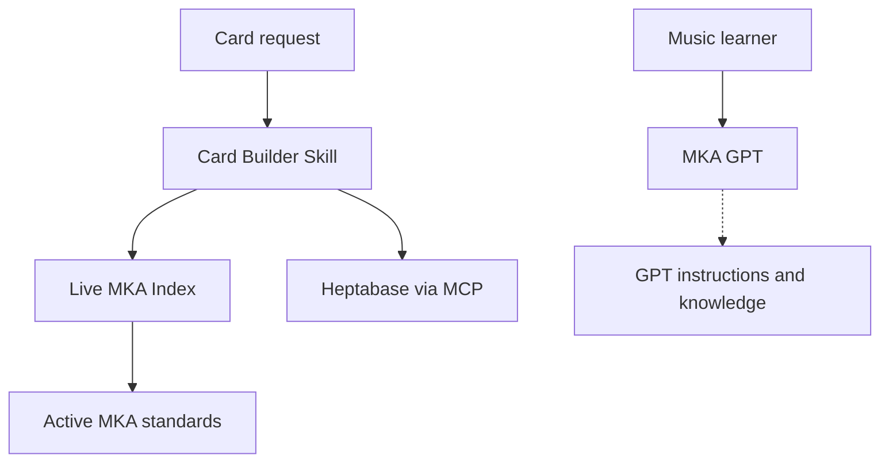

# MKA — Music Knowledge and Learning Agent

**Portfolio case study · Personal project · Started 2026**

MKA is an AI-assisted system for managing music knowledge and learning workflows in Heptabase. A central index selects active, task-specific standards; the relevant modules guide card creation or review; quality checks run before changes are written; and stored cards are read back for verification. The system also distinguishes learning events, reusable knowledge and learning-system models.

The project has **three related components**: the Heptabase MKA standards, an MKA Card Builder Skill for card operations, and a learner-facing MKA GPT. The Skill and GPT are separate interfaces. A direct GPT-to-Skill call has not been verified.

The MKA GPT offers **multilingual language selection**. Its entry page shows Traditional Chinese, German and English as examples, while learners can select other languages. **Conversation and generated-output languages can be set separately.** See [GPT design](docs/mka-gpt.md) for the distinction between entry labels, dialogue and output.

**Featured application:** [Daily practice planning](examples/daily-practice-planning.md). An enabled scheduled task targets 09:00 Europe/Berlin and instructs the assistant to use Heptabase MCP and MKA Card Builder to prepare a Practice Log for the current piece. This scheduled workflow is a separate entry point; the schedule is not itself a feature of the custom GPT.

> **Public scope:** Architecture, representative workflows, testing methodology and a small offline Python validator. The private Heptabase knowledge base and full operational standards are not included. The Python code is an illustrative component, not the production MKA agent or its MCP integration.

## The problem and design

One growing music workspace needs consistent repertoire, musician, music-history, theory and learning records. Different card types require different properties and structures. I designed a **single active router** (MKA Index), shared rules (Core), and modules for each supported domain. Search/review loads fewer modules than create/update. Changing a standard invokes test governance and affected regression cases. Historical sources remain inactive.

## Current scope

| Area | Current design |
|---|---|
| Repertoire and musicians | Separate structure, standard, template, QA and test responsibilities |
| Music history | Shared rules plus Epoche or Periode modules |
| Logs | Shared Log rules plus Practice, Lesson, Performance or Competition rules |
| Music theory | Dedicated Musiktheorie route |
| Music learning | Log (dated event), Wissenskarte (reusable knowledge/skill), Lernsystem (competency or feedback model) |
| Lernsystem | Shared Musiklernen Structure and Core QA; no separate active Lernsystem standard or template |

The routing matrix is maintained in the private MKA Index. This table is a portfolio summary, not an execution standard.

## How it works

The Skill's documented workflow is search → draft → pre-write QA → write → read-back QA. The GPT is designed as a conversational learning entry point; its actual editor settings and any direct connection to the Skill were not inspected for this snapshot. See [component relationships](docs/components.md), [Skill workflow](docs/card-builder-skill.md), [GPT design](docs/mka-gpt.md) and [architecture](docs/architecture.md).

For a **standard change**, test governance selects affected cases, records a Test Plan and a Test Report, and requires a read-back after activation.

## Representative workflows

1. [Daily practice planning](examples/daily-practice-planning.md): scheduled continuity, actual practice decisions, template checks and a documented format regression.
2. [Classify music-learning content](examples/music-learning-workflow.md): decide whether an observation belongs to a Log, Wissenskarte or Lernsystem.
3. [Repertoire card example](examples/end-to-end-repertoire-card.md): earlier reduced public draft. Retained as a historical illustration, not the complete current template.

## How it is tested

MKA separates **card QA** from **regression tests**. A rule or router change requires a Test Plan, an execution-specific Test Report, evidence for each case and post-activation verification. A normal card build uses applicable QA without implying full-system regression.

- [Testing strategy](tests/TESTING_STRATEGY.md)
- [Recorded evidence and limits](tests/TEST_RESULTS.md)
- Run the **limited offline demo**: `python -m unittest discover -s tests -v`

The Python suite verifies only its coded demonstration rules; its pass count does not certify the live MKA system.

The 2026-09-21 and 2026-09-22 Practice Logs were inspected as evidence for the featured workflow. A missing instruction paragraph in the latter is recorded as an open format regression; the scheduled task was updated later on 2026-09-22, and no subsequent automatic run has been verified here.

The live Card Builder Skill instructions were inspected for this update. No live execution of the Skill or editor-level GPT test was performed as part of this portfolio update; see the evidence table in [test results](tests/TEST_RESULTS.md).

## My contributions

I defined card-type boundaries and modular responsibilities, designed the single-entry routing and rule ownership, specified properties and relations, and developed the Card Builder Skill's operating requirements. I designed the GPT's learner conversation and language-selection requirements, plus the QA, version and regression governance. See [contributions and evidence](docs/contributions.md).

## Reference and privacy

Checked against live **MKA Index v2.10**, **MKA Test Governance v1.3**, **MKA Musiklernen Structure v1.0**, and the available Card Builder Skill instructions on **2026-09-22**. GPT editor settings were not available for direct verification. These references can change. Private notes, credentials and full standards are absent.
