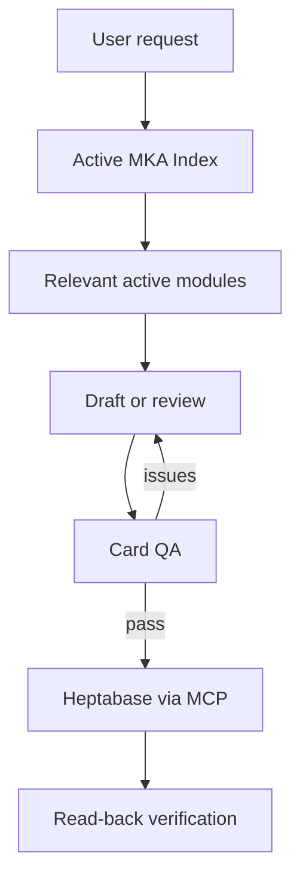

# MKA — Music Knowledge and Learning Agent

**Portfolio case study · Personal project · Started 2026**

MKA is an AI-assisted system for managing music knowledge and learning workflows in Heptabase. A central index selects active, task-specific standards; the relevant modules guide card creation or review; quality checks run before changes are written; and stored cards are read back for verification. The system also distinguishes learning events, reusable knowledge and learning-system models.

> **Public scope:** Architecture, representative workflows, testing methodology and a small offline Python validator. The private Heptabase knowledge base and full operational standards are not included. The Python code is an illustrative component, not the production MKA agent or its MCP integration.

## The problem and design

One growing music workspace needs consistent repertoire, musician, music-history, theory and learning records. Different card types require different properties and structures. I designed a **single active router** (MKA Index), shared rules (Core), and modules for each supported domain. Search/review loads fewer modules than create/update. Changing a standard invokes test governance and affected regression cases. Historical sources remain inactive.

## Current scope

| Area | Current design |
|---|---|
| Repertoire and musicians | Separate structure, standard, template, QA and test responsibilities |
| Music history | Shared rules plus Epoche or Periode modules |
| Logs | Shared Log rules plus Practice, Lesson, Performance or Competition rules |
| Music theory | Dedicated Musiktheorie route |
| Music learning | Log (dated event), Wissenskarte (reusable knowledge/skill), Lernsystem (competency or feedback model) |
| Lernsystem | Shared Musiklernen Structure and Core QA; no separate active Lernsystem standard or template |

The routing matrix is maintained in the private MKA Index. This table is a portfolio summary, not an execution standard.

## How it works

For a **standard change**, test governance selects affected cases, records a Test Plan and a Test Report, and requires a read-back after activation. See [architecture and routing](docs/architecture.md).

## Representative workflows

1. [Classify music-learning content](examples/music-learning-workflow.md): decide whether an observation belongs to a Log, Wissenskarte or Lernsystem.
2. [Repertoire card example](examples/end-to-end-repertoire-card.md): earlier reduced public draft. Retained as a historical illustration, not the complete current template.

## How it is tested

MKA separates **card QA** from **regression tests**. A rule or router change requires a Test Plan, an execution-specific Test Report, evidence for each case and post-activation verification. A normal card build uses applicable QA without implying full-system regression.

- [Testing strategy](tests/TESTING_STRATEGY.md)
- [Recorded evidence and limits](tests/TEST_RESULTS.md)
- Run the **limited offline demo**: `python -m unittest discover -s tests -v`

The Python suite verifies only its coded demonstration rules; its pass count does not certify the live MKA system.

## My contributions

I defined card-type boundaries and modular responsibilities, designed the single-entry routing and rule ownership, specified properties and relations, introduced active/legacy version control and post-write verification, and designed acceptance criteria and regression governance. I reviewed stored outcomes and corrected requirements when tests or cards revealed mismatches. See [contributions and evidence](docs/contributions.md).

## Reference and privacy

Checked against live **MKA Index v2.10**, **MKA Test Governance v1.3** and **MKA Musiklernen Structure v1.0** on **2026-09-22**. These references can change. Private notes, credentials and full standards are absent.
