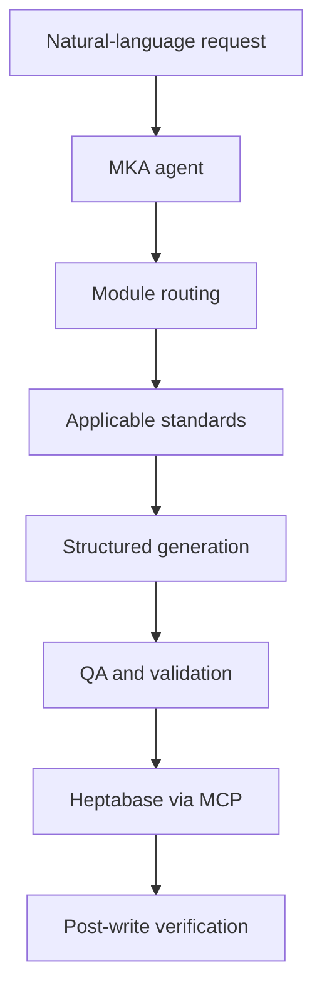

# MKA – AI Agent for Music Knowledge Management

MKA is a modular AI agent for creating, validating and maintaining structured music knowledge, repertoire data and practice workflows in Heptabase.

This repository is a privacy-safe portfolio case study. It demonstrates the architecture, workflow and quality-assurance approach without publishing private notes, credentials or the complete production rule set.

## The problem

Music-related knowledge is distributed across repertoire notes, practice logs, musicians, music history and learning materials. As the knowledge base grows, manually maintaining consistent structures, metadata, relationships and naming conventions becomes increasingly difficult.

## The solution

MKA converts natural-language requests into controlled workflows. It identifies the requested card type, loads only the applicable standards, generates structured content, runs validation and quality checks, and communicates with Heptabase through the Model Context Protocol (MCP).

## Key features

- Modular routing for repertoire, musician, music-history and log workflows
- Heptabase integration through MCP
- Selective loading of task-specific rules
- Validation of structure, metadata, naming and relations
- Multi-stage quality assurance and post-write verification
- Regression tests for changes to shared rules
- Versioned standards with active and legacy separation
- Automated practice-planning and progress-documentation workflows

## Architecture



See [Architecture](docs/architecture.md) for component responsibilities and boundaries.

## End-to-end example

The public example shows how a request for a Bach repertoire card is routed, generated and validated before a simulated write operation.

See [Repertoire card workflow](examples/end-to-end-repertoire-card.md).

## Testing

The public test suite validates a representative subset of the production behaviour:

- routing by card type;
- rejection of unsupported metadata values;
- detection of missing required sections;
- exclusion of legacy standards from active workflows;
- successful validation of a conforming repertoire card.

Run the tests with:

```bash
python -m unittest discover -s tests -v
```

See [Testing strategy](tests/TESTING_STRATEGY.md) and [Test results](tests/TEST_RESULTS.md).

## Repository structure

```text
mka-ai-agent/
├── README.md
├── docs/
│   └── architecture.md
├── examples/
│   └── end-to-end-repertoire-card.md
├── src/
│   ├── __init__.py
│   └── public_validator.py
└── tests/
    ├── TESTING_STRATEGY.md
    ├── TEST_RESULTS.md
    └── test_public_validator.py
```

## My contribution

- Requirements analysis and domain modelling
- Modular agent and rule architecture
- Workflow and interface design
- Acceptance criteria and regression-test design
- Metadata and content validation
- Migration and legacy strategy
- Iterative validation with real music-learning workflows

## Privacy and scope

The public repository intentionally excludes:

- Heptabase credentials and connection details;
- private practice logs and personal information;
- complete production prompts and proprietary rules;
- raw workspace exports.

All examples use public-domain repertoire information and reduced demonstration rules. The validator is a standalone public demonstration, not the complete production agent.

## Status

Active personal project, started in 2026. The architecture continues to evolve through new workflows, acceptance tests and controlled rule migrations.
