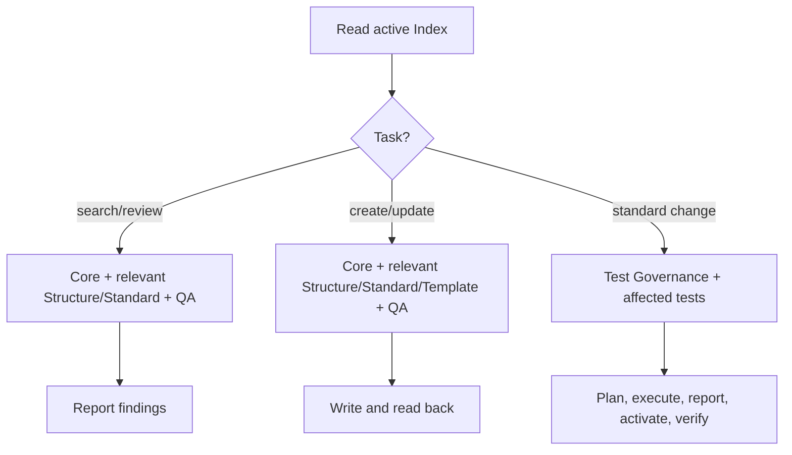
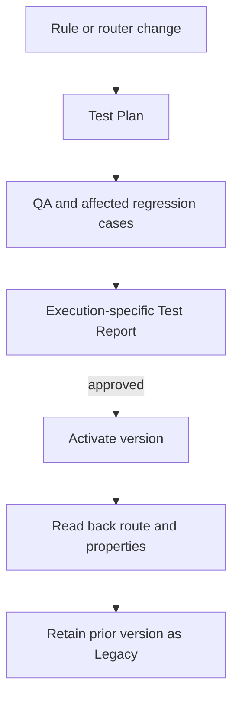

# Architecture and routing

**Reference snapshot:** MKA Index v2.10, Test Governance v1.3 and Musiklernen Structure v1.0, read 2026-09-22 from active Heptabase cards.

| Part | Responsibility |
|---|---|
| MKA Index | Sole active entry point; selects active modules by request and resolves precedence. Contains routing, not detailed card rules. |
| Core / Core QA | Shared execution, sources, safety, naming checks, reporting and verification. |
| Structure | Domain model, card boundaries, properties and relationships. |
| Standard | Behaviour and content requirements for the applicable card type. |
| Template | Formal output structure where an active route defines one. |
| QA | Checks a concrete draft or card; does not create rules. |
| Tests / Test Governance | Regression cases, selection, Test Plan, Test Report and activation decision. Not loaded for routine builds. |
| MCP interaction | Searches and changes Heptabase objects, then reads persisted content and properties back. |

## Request routing

For Musiklernen, the shared Structure distinguishes:

| Card type | Purpose | Property rule |
|---|---|---|
| Log | Real, dated practice, lesson, performance or competition event | Log Type and event date required |
| Wissenskarte | Reusable musical knowledge or skill | Log Type empty; date normally empty |
| Lernsystem | Higher-level competencies, goals, priorities and feedback loop | Log Type and date empty |

The active Lernsystem route uses **MKA Musiklernen Structure + MKA Core QA**. Previously drafted separate Lernsystem Structure, Standard, Template, QA and Tests are obsolete. Wissenskarte has its own active modules.

## Change lifecycle

The live governance distinguishes `Stand` (actual edit date) from `Version` (substantive rule version). A draft passes required QA and regression before activation. A failed post-activation check cannot be reported as successful activation. A factual edit to one card does not automatically require regression.

## Public boundary

The repository's reduced validator does not load the private Index, invoke an LLM, call Heptabase MCP, verify native tables or prove all active modules pass regression. Those claims require the corresponding live reports.
