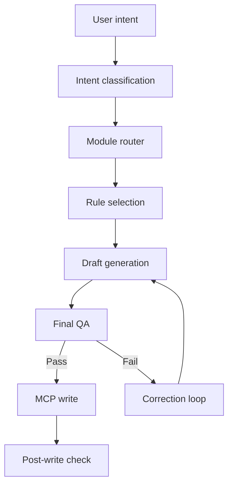
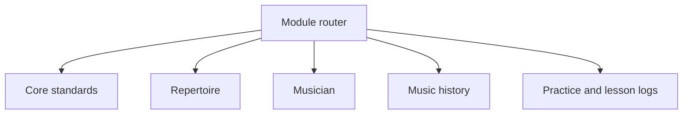

# System Architecture

## Design goals

MKA was designed to keep an expanding knowledge system consistent without loading every rule for every request. The architecture separates shared rules, card-type-specific standards, generation, validation and persistence.

## Processing flow

## Components

| Component | Responsibility |
|---|---|
| Intent classifier | Determines whether the request concerns repertoire, musicians, music history or a log workflow. |
| Module router | Selects the applicable module and prevents unrelated standards from being loaded. |
| Core standards | Provides shared naming, metadata, relation and lifecycle rules. |
| Module standards | Defines required sections and rules for one supported card type. |
| Generator | Produces the draft content and metadata from the request and retrieved context. |
| QA layer | Checks structure, approved values, relations and consistency before persistence. |
| MCP adapter | Searches, creates and updates cards in Heptabase. |
| Post-write verifier | Re-reads the stored result and checks whether the intended structure was persisted. |

## Rule routing

The core is shared. Each task loads only one relevant module unless an explicit cross-module relation is required.

## Quality gates

1. **Input gate:** clarify missing information that would materially change the result.
2. **Routing gate:** select a supported card type and active standard version.
3. **Draft validation:** check headings, properties, approved values and relations.
4. **Final QA:** evaluate the complete draft against acceptance criteria.
5. **Post-write verification:** confirm that the persisted card matches the validated draft.

## Versioning and migration

Active standards and legacy standards are separated. A legacy rule may remain available for interpreting existing cards, but it must not silently influence new content. Rule changes trigger targeted regression tests for affected modules before the active route is updated.

## Security and privacy boundary

Credentials are provided only at runtime and are never stored in the repository. Public examples contain reduced rules and anonymised data. The production Heptabase workspace, personal practice records and complete MKA standards remain outside the public project.
