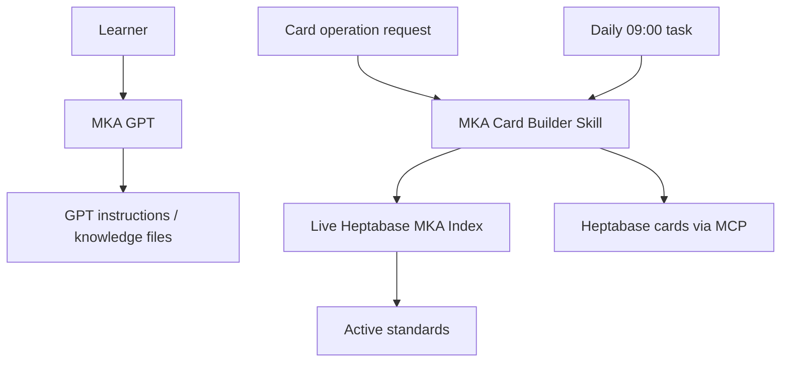

# Three components, one MKA project

| Component | Where it lives | Responsibility | Evidence for this snapshot |
|---|---|---|---|
| MKA standards | Heptabase cards | Active Index, data models, standards, templates, QA, tests and version governance | Live Index v2.10, Test Governance v1.3 and Musiklernen Structure v1.0 read on 2026-09-22 |
| MKA Card Builder Skill | AI assistant Skill instructions | Operational procedure for searching, building, checking and updating cards through Heptabase MCP | Available Skill instructions read on 2026-09-22 |
| MKA GPT | Custom GPT configuration | Learner-facing multilingual conversation and independently selectable generated-output language; entry page illustrates three languages without limiting other choices | Design requirements confirmed by owner; live GPT editor configuration not independently read |
| Daily scheduled task | ChatGPT automation | Starts the daily Practice Log workflow at 09:00 Europe/Berlin; requests Skill and Heptabase MCP use | Enabled schedule and current prompt inspected 2026-09-22 |

## Relationship

The diagram shows **confirmed Skill routing** and the **separate GPT design**. It deliberately does not draw a GPT → Skill invocation. Whether the GPT can access the live Index or write cards depends on its actual configured capabilities; those settings have not been verified here. Knowledge-file exports can represent a snapshot, but must not silently be presented as the live Index.

The scheduled task is an additional application of the Skill and MCP. Its time trigger is managed separately from the learner-facing GPT.

The MKA project belongs in **one portfolio repository** with separate documentation for each component. This makes their distinct responsibilities visible without counting them as three unrelated projects.
