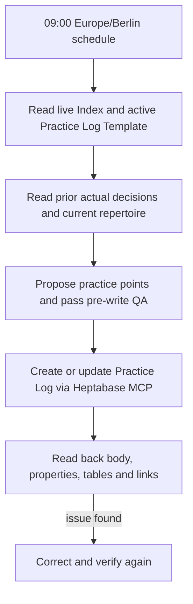

# Featured application: daily practice planning

**Evidence snapshot: 2026-09-22.** The enabled task “每日 Repertoire 練習卡” is scheduled every day at **09:00 Europe/Berlin**. Its saved prompt explicitly calls for Heptabase MCP and MKA Card Builder. The trigger time is a schedule, not proof that every card was delivered at exactly 09:00.

## Why this exists

A practice card is prepared before the session so the learner receives specific suggestions and measurable completion criteria. The learner fills in actual practice time, progress, problems, results and next decisions afterward. Those actual decisions have priority when planning the next day. The current example follows Chopin's Scherzo No. 2, Op. 31.

## Workflow

The task first checks whether today's Log already exists. On Friday it uses the previous seven days for a weekly plan and puts only Day 1 on that day's card. On other days it follows the previous actual record. If no new result was recorded, it must say so and preserve the latest confirmed state. It must not invent teacher feedback or completed practice.

The prompt leaves the **active Practice Log Template** as the sole source of formatting. At this snapshot, the live Template is **v1.3** (`Aktiv=true`, `Stand=2026-09-21`). The prompt itself does not duplicate the template's headings and table layouts. The Skill runs pre-write QA and post-write read-back, and the task requests actual `Musiklernen` membership, date, `Log Type=Practice`, instrument and Repertoire relation.

## Observed outputs

The private workspace contains Practice Logs dated **2026-09-21** and **2026-09-22** for the Chopin piece. Both were read for this case study. Both have `Kartentyp=Log`, `Log Type=Practice`, `Instrument=Klavier`, the matching date and a Repertoire relation. Their pre-session plans specify bar ranges, methods, time budgets and completion criteria. The post-session result cells were empty in both inspected cards, so these cards do **not** prove that the user completed the exercises or that the 22 September plan incorporated new actual results from the 21st.

For example, the 22 September card retains mm. 669–673 as a sight-reading task, separates harmonic entry points around mm. 468–470 and 492–499, and retains memory starts at m. 33 and m. 117. These personal details are summarised here rather than published as screenshots or full card exports.

## Observed defect and follow-up

The 21 September card included an instruction paragraph under “練習後紀錄” explaining that this is the only part the learner fills after practice. The 22 September card omitted that paragraph while retaining the headings and table. This is a **format deviation from the active Template**. The saved automation prompt was edited later on 22 September to require live Template loading and read-back checks. Its recorded last run preceded that edit. This case study therefore records **prompt updated; next scheduled output not yet verified**. It does not label the regression fixed.

## Evidence boundary

This repository does not contain the schedule credential, personal Heptabase cards or an executable production runner. The public seven-test Python suite does not test this automation. To demonstrate a completed fix, capture a subsequent scheduled card and a QA report showing the template paragraph, native table shape, empty actual-result cells, actual properties and Repertoire backlink after read-back.
